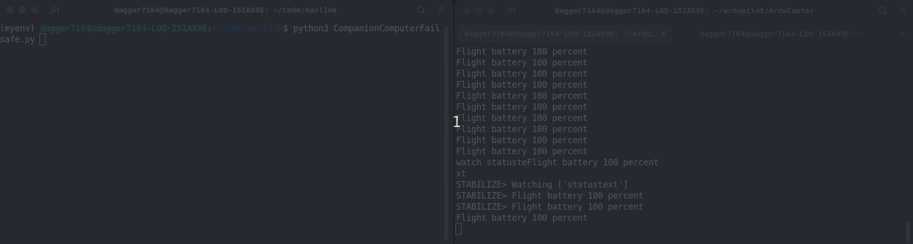
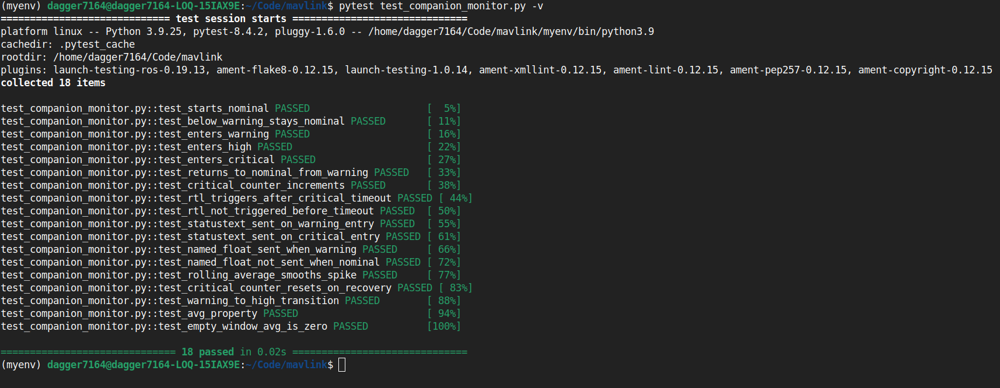
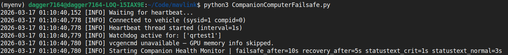

# ArduPilot Companion Computer Health Monitor & Failsafe

> **TL;DR**
> - Companion daemon → monitors CPU, RAM, disk, temperature, GPU, and critical processes
> - Sends MAVLink HEARTBEAT, STATUSTEXT alerts, and NAMED_VALUE_FLOAT metrics to GCS
> - Triggers RTL failsafe after sustained CRITICAL load — recovers automatically when healthy
> - Tested: RPi 3B+ + Pixhawk over UART, and laptop + ArduPilot SITL over UDP

---

## Table of Contents

- [The problem](#the-problem)
- [What is built](#what-is-built)
- [Architecture](#architecture)
- [Hardware tested on](#hardware-tested-on)
- [Quick start](#quick-start)
- [Screenshots & Demo](#screenshots--demo)
- [Configuration](#configuration)
- [Repo structure](#repo-structure)
- [Future Development](#future-development)
- [Motivation](#motivation)
- [References](#references)
- [Contributing](#contributing)

---

A MAVLink-native daemon that runs on a companion computer (Raspberry Pi, Jetson, or any Linux SBC) alongside ArduPilot. It monitors system health in real time and autonomously triggers a failsafe when the companion degrades — so the flight controller always knows what the companion is doing.

Built as a GSoC 2026 sample for the ArduPilot project idea: **Real-Time Companion-Computer Health Monitoring & Failsafe**.

---

## The problem

Modern UAV systems use a companion computer for computer vision, obstacle avoidance, AI inference, and custom autonomy. But ArduPilot has no standardized way to know if that companion is healthy. If it overheats, crashes, or runs out of memory mid-mission — the flight controller remains completely unaware.

This project defines that standard.

---

## What is built

### Companion-side daemon (`companionComputerFailsafe.py`)

| Feature | Detail |
|---|---|
| **MAVLink HEARTBEAT** | Sent every second from the companion as `MAV_TYPE_ONBOARD_CONTROLLER` on a dedicated thread. Makes the companion visible as a second system in Mission Planner and QGC. A GCS or MAVProxy script can detect heartbeat silence and alert the operator. Full ArduPilot-side failsafe on heartbeat loss requires `FS_GCS_ENABLE` configuration or a custom ArduPilot parameter — planned as the next development step. |
| **Rolling-average health monitor** | CPU %, RAM %, Disk %, CPU temperature, GPU temperature (RPi via `vcgencmd`). Each metric uses a configurable rolling window to filter spikes before alerting. |
| **4-state machine per metric** | Every resource independently transitions through `NOMINAL → WARNING → HIGH → CRITICAL`. State changes are logged and broadcast as MAVLink `STATUSTEXT`. |
| **RTL failsafe** | After a configurable number of seconds sustained in CRITICAL, sends `MAV_CMD_NAV_RETURN_TO_LAUNCH` and waits for a `COMMAND_ACK` from the vehicle to confirm it was accepted. |
| **Automatic recovery** | Once all metrics return below WARNING thresholds AND all watched processes are alive again for a configurable duration, the original flight mode is restored via `MAV_CMD_DO_SET_MODE` — also with `COMMAND_ACK` verification. |
| **Critical services watchdog** | User-defined processes monitored by name via `psutil`. On death: attempts `systemctl restart` up to N times, waits for the process to reappear, then triggers RTL if all restarts fail. |
| **`NAMED_VALUE_FLOAT` broadcasts** | Each metric is broadcast as a named float whenever it crosses WARNING or above — visible as live graphs in Mission Planner and MAVProxy. |
| **STATUSTEXT rate limiter** | Critical messages throttled to 1s intervals, normal messages to 3s — prevents MAVLink bus saturation during a fault. |
| **YAML configuration** | All thresholds, timeouts, MAVLink connection, and watchdog processes are in `configuration.yaml`. No recompile, no magic numbers in code. |
| **Structured file logging** | Every event written to `companion_health.log` with timestamps for post-flight debugging. |

### Unit tests (`test_companion_monitor.py`)

18 pytest tests covering the `ResourceMonitor` state machine in full isolation — no MAVLink connection, no hardware, no config file needed. Tests verify state transitions, rolling average smoothing, RTL trigger timing, NAMED_VALUE_FLOAT gating, and edge cases.

---

## Architecture

```
┌─────────────────────────────────────────────────────┐
│                  Companion Computer                  │
│                                                      │
│  ┌─────────────────────────────────────────────┐    │
│  │         companionComputerFailsafe.py         │    │
│  │                                              │    │
│  │  ┌──────────┐  ┌──────────┐  ┌──────────┐  │    │
│  │  │   CPU    │  │   RAM    │  │   DISK   │  │    │
│  │  │ monitor  │  │ monitor  │  │ monitor  │  │    │
│  │  └────┬─────┘  └────┬─────┘  └────┬─────┘  │    │
│  │       │              │              │         │    │
│  │  ┌────┴──────────────┴──────────────┴─────┐  │    │
│  │  │         State Machine (per metric)      │  │    │
│  │  │   NOMINAL → WARNING → HIGH → CRITICAL  │  │    │
│  │  └────────────────────┬────────────────────┘  │    │
│  │                       │                        │    │
│  │  ┌────────────────────▼────────────────────┐  │    │
│  │  │           Failsafe / Recovery            │  │    │
│  │  │  trigger_rtl()     recover_mode()        │  │    │
│  │  │  + COMMAND_ACK     + COMMAND_ACK         │  │    │
│  │  └────────────────────┬────────────────────┘  │    │
│  │                       │                        │    │
│  │  ┌───────────┐  ┌─────┴──────┐  ┌──────────┐ │    │
│  │  │ HEARTBEAT │  │  STATUSTEXT│  │  NAMED_  │ │    │
│  │  │  thread   │  │ rate limit │  │  VALUE_  │ │    │
│  │  └───────────┘  └────────────┘  │  FLOAT   │ │    │
│  │                                  └──────────┘ │    │
│  │  ┌────────────────────────────────────────┐   │    │
│  │  │         ServiceWatchdog (per proc)      │   │    │
│  │  │  alive? → restart → RTL if all fail    │   │    │
│  │  └────────────────────────────────────────┘   │    │
│  └──────────────────────┬──────────────────────┘    │
│                         │ MAVLink (UART / UDP)        │
└─────────────────────────┼───────────────────────────┘
                          │
┌─────────────────────────▼───────────────────────────┐
│              Pixhawk / ArduPilot FC                  │
│                                                      │
│   Receives: HEARTBEAT, STATUSTEXT,                   │
│             NAMED_VALUE_FLOAT, COMMAND_LONG          │
│   Sends:    COMMAND_ACK, HEARTBEAT, flight mode      │
└──────────────────────────────────────────────────────┘
                          │
              USB / telemetry radio
                          │
┌─────────────────────────▼───────────────────────────┐
│           GCS (Mission Planner / QGroundControl)     │
│                                                      │
│   Messages tab  → STATUSTEXT alerts                  │
│   Quick tab     → NAMED_VALUE_FLOAT live values      │
│   Vehicle list  → companion HEARTBEAT visible        │
└──────────────────────────────────────────────────────┘
```

---

## Hardware tested on

- Raspberry Pi 3B+ → Pixhawk via UART (TELEM2)
- Laptop (Ubuntu 22.04) → ArduPilot SITL via UDP

---

## Quick start

### 1. Install dependencies

```bash
pip install -r requirements.txt
```

### 2. Configure

Edit `configuration.yaml` to match your setup:

```yaml
mavlink:
  connection: "/dev/serial0"   # UART on RPi
  # connection: "udp:127.0.0.1:14550"  # SITL on laptop
  system_id: 42
  component_id: 191

thresholds:
  cpu:
    warning: 70
    high: 80
    critical: 90

watchdog:
  max_restart_attempts: 2
  processes:
    - name: your_process_name
      service: your_process.service
```

### 3. Run

```bash
python3 companionComputerFailsafe.py
```

### 4. Test with SITL (no hardware needed)

```bash
# Terminal 1 — launch ArduPilot SITL
sim_vehicle.py -v ArduCopter --console --map

# Terminal 2 — run the monitor (lower thresholds temporarily to trigger failsafe fast)
python3 companionComputerFailsafe.py
```

To force a failsafe immediately, set `cpu: warning: 5` in `configuration.yaml` — normal laptop load will trigger it within seconds.

### 5. Run unit tests

```bash
pip install pytest
pytest test_companion_monitor.py -v
```

Expected: **18 passed**.

---

## Screenshots & Demo

> **Add your images here.** Put screenshots and GIFs in the `assets/` folder, then replace the placeholders below.
> On Ubuntu, use `Peek` (`sudo apt install peek`) to record a screen region directly as a GIF.

### Failsafe trigger and recovery
*Terminal showing the full `NOMINAL → WARNING → CRITICAL → FAILSAFE → RECOVERING → NOMINAL` cycle.*

<!-- Record this with Peek while running: set cpu warning: 5 in config, launch SITL, run the script -->


---

### Unit tests passing
*18 pytest tests covering ResourceMonitor state transitions — no hardware needed.*

<!-- Screenshot of: pytest test_companion_monitor.py -v -->


---

### SITL connection
*Script connected to ArduPilot SITL over UDP, heartbeat confirmed.*

<!-- Screenshot of the terminal at startup showing "Connected to vehicle" -->


---

## Configuration

All settings live in `companion/configuration.yaml` — every field is inline-commented. Key parameters:

| Parameter | Default | What it controls |
|---|---|---|
| `sample_interval` | 1s | How often metrics are read |
| `rolling_window` | 5 | Samples averaged before alerting |
| `timeouts.critical_failsafe` | 10s | Sustained CRITICAL before RTL |
| `timeouts.recovery` | 5s | Clean seconds needed before mode restore |
| `thresholds.*.warning/high/critical` | 70/80/90% | Per-metric alert levels |
| `watchdog.max_restart_attempts` | 2 | Restart tries before RTL |

See [`companion/configuration.yaml`](companion/configuration.yaml) for the full file.

---

## Repo structure

```
.
├── companionComputerFailsafe.py   # main daemon
├── configuration.yaml            # all settings
├── test_companion_monitor.py     # 18 pytest unit tests
├── companion_health.log          # runtime log (auto-created)
└── README.md
```

---

## Motivation

I've built autonomous drones using Pixhawk and ArduPilot, and worked with DroneKit and MAVSDK for autonomous mission execution. Through that hands-on experience I repeatedly hit the same problem — there is no standardized, reliable way for the flight controller to know when the companion powering the autonomy stack has degraded or failed.

This project defines that standard as a proper MAVLink-native mechanism that any companion computer can run and any ArduPilot user can configure without touching ArduPilot source code.

---

## Future Development

This section outlines what a full GSoC 175-hour implementation would add on top of what is already built. The current codebase is the companion-side foundation — the next phase is ArduPilot-side integration.

---

### 1. ArduPilot-side heartbeat failsafe (C++ ArduPilot contribution)

**The core ArduPilot contribution this GSoC project targets.**

Currently our companion sends a MAVLink `HEARTBEAT` every second, but ArduPilot takes no automatic action if it goes silent. The plan is to add native support inside ArduPilot's failsafe system:

- Add a new parameter `CC_HB_ENABLE` — enables/disables companion heartbeat monitoring
- Add a new parameter `CC_HB_TIMEOUT` — seconds of silence before failsafe triggers (default: 5)
- Add a new parameter `CC_FS_ACTION` — action on timeout: `0=None`, `1=Warn`, `2=Land`, `3=RTL`
- ArduPilot watches for `MAV_TYPE_ONBOARD_CONTROLLER` heartbeats on the telemetry port
- If silence exceeds `CC_HB_TIMEOUT`, the configured failsafe action fires automatically

This means if the companion computer crashes, freezes, or loses UART connection to the Pixhawk mid-flight — the drone reacts on its own, without any GCS involvement.

**Planned implementation inside ArduPilot:**

- Located in `libraries/AP_Failsafe` — the existing home for all ArduPilot failsafe logic (GCS failsafe, RC failsafe, battery failsafe)
- Heartbeat tracking added inside `GCS_MAVLink/GCS.cpp` — specifically in the `handle_heartbeat()` message handler, which already processes incoming `MAV_TYPE_ONBOARD_CONTROLLER` messages
- A `last_companion_heartbeat_ms` timestamp updated on every valid companion heartbeat received
- Timeout check added to the existing `AP_Failsafe::check()` loop — same loop that already handles GCS and RC link loss
- Failsafe action dispatched through the existing `AP_Failsafe::trigger_action()` pipeline, keeping behaviour consistent with all other ArduPilot failsafes
- New parameters registered in `AP_Failsafe/AP_Failsafe.cpp` using the standard `AP_PARAM` macro — no recompile needed once merged, just parameter changes from GCS

This keeps the implementation consistent with existing ArduPilot safety architecture and minimises the diff — the heartbeat loss detection is a ~50 line addition to files that already handle this class of problem.

---

### 2. Custom `COMPANION_HEALTH` MAVLink message

Currently metrics are broadcast as individual `NAMED_VALUE_FLOAT` messages — one per metric per event. The proper solution is a single structured MAVLink message that carries everything in one packet:

```
COMPANION_HEALTH {
    time_boot_ms    : uint32
    cpu_load        : uint8     // percent
    ram_load        : uint8     // percent
    disk_load       : uint8     // percent
    cpu_temp        : int16     // Celsius * 10
    gpu_temp        : int16     // Celsius * 10
    service_status  : uint16    // bitmask — 1 bit per watched process
    failsafe_state  : uint8     // 0=NOMINAL 1=WARNING 2=CRITICAL 3=FAILSAFE
}
```

This requires adding a message definition to the ArduPilot MAVLink dialect XML and regenerating the pymavlink bindings.

---

### 3. MAVProxy companion health module

A loadable MAVProxy module that displays a live companion health dashboard in the GCS terminal:

```
[COMPANION]  CPU: 34%  RAM: 51%  DISK: 33%  TEMP: 58C  STATE: NOMINAL
[COMPANION]  Services: qrtest1=ALIVE  mavros=ALIVE
```

Loaded with `module load companion_health` — no extra tools needed on the ground station.

---

### 4. Configurable failsafe actions per trigger

Currently every failsafe condition triggers RTL. The full implementation would let each trigger have its own action:

```yaml
failsafe_actions:
  cpu_critical:  RTL
  ram_critical:  LAND
  temp_critical: RTL
  service_dead:  HOLD
  heartbeat_lost: RTL
```

Maps directly to the `CC_FS_ACTION` ArduPilot parameter family.

---

### 5. GPU monitoring for Jetson (tegrastats backend)

The current GPU reader uses `vcgencmd` which is Raspberry Pi only. A `tegrastats` backend for Nvidia Jetson would make the daemon platform-agnostic:

```python
# Jetson backend stub (planned)
result = subprocess.run(["tegrastats", "--interval", "1000"],
                        capture_output=True, text=True, timeout=2)
# parse "GPU 45%" and "Temp GPU@52C" from result.stdout
```

The `ResourceMonitor` class already handles any float value — only the reader function needs a platform-specific implementation.

---

### 6. Systemd service for the daemon itself

Currently the script must be started manually. Packaging it as a systemd service means it starts automatically on boot and gets restarted by systemd if it crashes:

```ini
[Unit]
Description=ArduPilot Companion Health Monitor
After=network.target

[Service]
ExecStart=/usr/bin/python3 /home/pi/companionComputerFailsafe.py
Restart=always
RestartSec=3

[Install]
WantedBy=multi-user.target
```

If systemd restarts the daemon after a crash, there is a brief heartbeat gap — ArduPilot detects this gap via `CC_HB_TIMEOUT` and can trigger a warn-only action rather than a full RTL.

---

## References

- [ArduPilot Developer Documentation](https://ardupilot.org/dev/)
- [MAVLink Developer Guide](https://mavlink.io/en/)
- [pymavlink — GitHub](https://github.com/ArduPilot/pymavlink)
- [ArduPilot SITL Setup](https://ardupilot.org/dev/docs/sitl-simulator-software-in-the-loop.html)
- [GSoC 2026 ArduPilot Project Ideas](https://ardupilot.org/dev/docs/gsoc-ideas-list.html)

---

## Contributing

This project is being developed as a GSoC 2026 proposal for the ArduPilot organization.

```bash
git checkout -b feature/your-feature
git commit -m 'Add: your feature'
git push origin feature/your-feature
# then open a Pull Request
```
